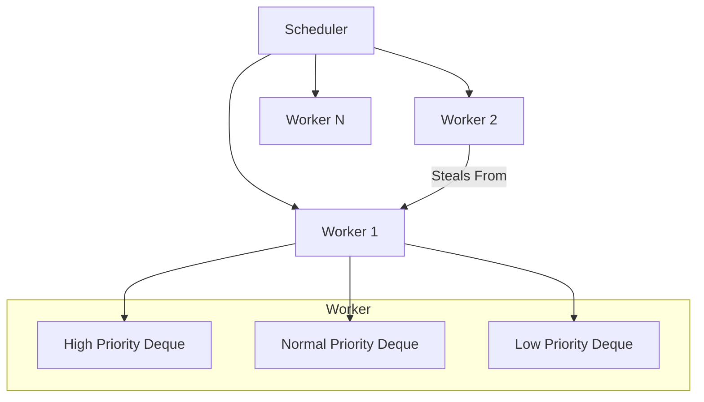

# Architecture

The Async Task Scheduler is designed for high-performance and low-latency task execution. This page describes the internal components and how they interact.

## Component Overview

### 1. Scheduler
The `Scheduler` class is the main entry point. It initializes a pool of `Worker` threads and handles the initial distribution of tasks. It uses a round-robin or least-loaded strategy (depending on configuration) to place tasks into worker queues.

### 2. Worker
Each `Worker` runs on a dedicated thread. Its main loop consists of:
1. Checking its local **High Priority** deque.
2. If empty, attempting to **steal** a High Priority task from another worker.
3. Checking its local **Normal Priority** deque.
4. Checking its local **Low Priority** deque.
5. If all local queues are empty, it enters a "stealing phase" where it tries to help other workers.

### 3. Work-Stealing Deque
The `WorkStealingDeque` is a thread-safe, double-ended queue. 
- **LIFO (Last-In-First-Out)** for the owner: The worker thread pushes and pops from the **front**. This improves cache locality.
- **FIFO (First-In-First-Out)** for stealers: Other workers pop from the **back**. This reduces contention with the owner.

### 4. Tasks & Coroutines
Tasks are implemented using C++20 coroutines. This allows tasks to be suspended and resumed without blocking the underlying OS thread, which is crucial for high-concurrency systems.

## Performance Considerations
- **Lock Contention**: Minimized by using per-thread deques and a work-stealing algorithm.
- **Memory Allocations**: The system aims to minimize allocations in the hot path. Future improvements include a custom memory pool for tasks.
- **Cache Locality**: By using a LIFO approach for the local worker, we increase the likelihood that task data is still in the CPU cache.
